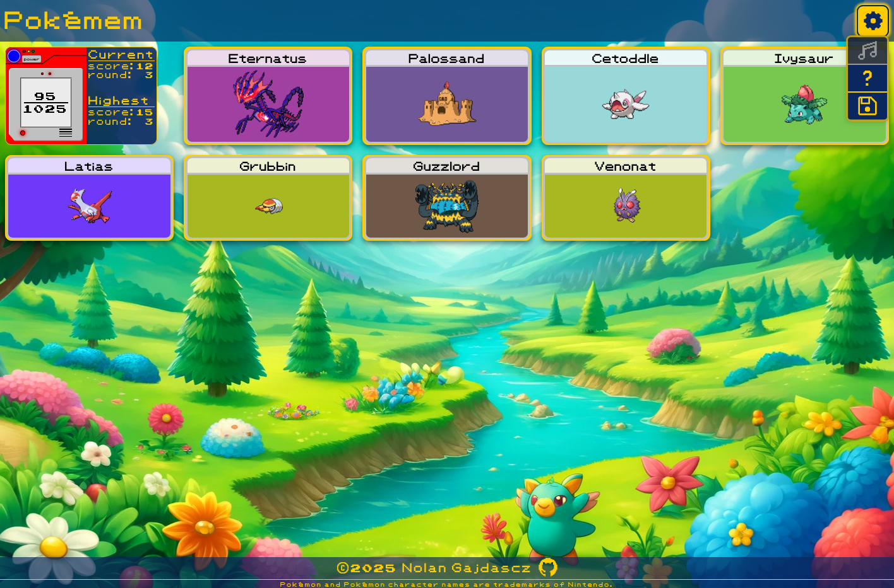

# Pokémem

> A Pokémon-themed memory challenge game. Click unique cards without repetition
> to climb through progressively harder rounds.

## 🔗 [**Play Now**](https://gajdascz.github.io/Pokemem/)

## 🎮 Gameplay

## Instructions

### Objective

Click each card **once per round**. Each correct click earns +1 point.

### Progression

After correctly selecting all cards in a round, you advance to the next.

- **Each round adds +2 cards**
  - Round 0: 2 cards
  - Round 1: 4 cards
  - Round 2: 6 cards
  - ...

### Penalty

Clicking the **same card twice in a single round** resets your score and round
to 0.  
Your **best run** is saved only when you manually end your game.

---

## ⚙️ Features

### 📖 Pokédex

A toggleable UI that tracks discovered Pokémon in real time.

- **Power switch:** turns Pokédex on/off.
- **Idle view:** summary of discovered Pokémon (`found / total`).
- **Open view:** full list showing either `????` (not found) or names with
  progress %.

### 💾 Save System

- Game progress is **auto-saved** in browser `localStorage`.
- Manual:
  - **Export**: download save as `.json`
  - **Import**: resume from a previous save
  - **Reset**: wipe all progress (⚠️ irreversible unless exported first)

### 📱 Responsive UI

Optimized for mobile-first play, with full support for desktop and tablet
resolutions.

---

## 🧠 Internals Overview

- `GameController`: Coordinates state, save/load logic, and external I/O (UI
  events, emitter).
- `GameState`: Aggregates and manages the main game state (meta, cards, scores,
  etc.) using functional updates.
- `Cards`, `Scores`, `Pokedex`, etc.: Modular state slices implementing
  domain-specific logic.
- `Emitter`: Pub-sub utility used for decoupling loading/sync events.
- `LocalStorage`: Abstracts persistent storage with import/export/auto-save
  support.
- `PokeApi`: Interface for PokeApi data fetching and error handling.

---

## 🛠️ Tech Stack

- **TypeScript, HTML, CSS**
- **React** (UI library)
- **Vite** (bundler & dev server)
- **PokeAPI** — Pokémon metadata and sprites
- **Pixabay** — 8-bit background music
- **Audacity** — Audio editing for seamless looping
- **DALL·E 3** — Generated image assets

---

## License

[MIT](./LICENSE)

Copyright © 2025 Nolan Gajdascz
